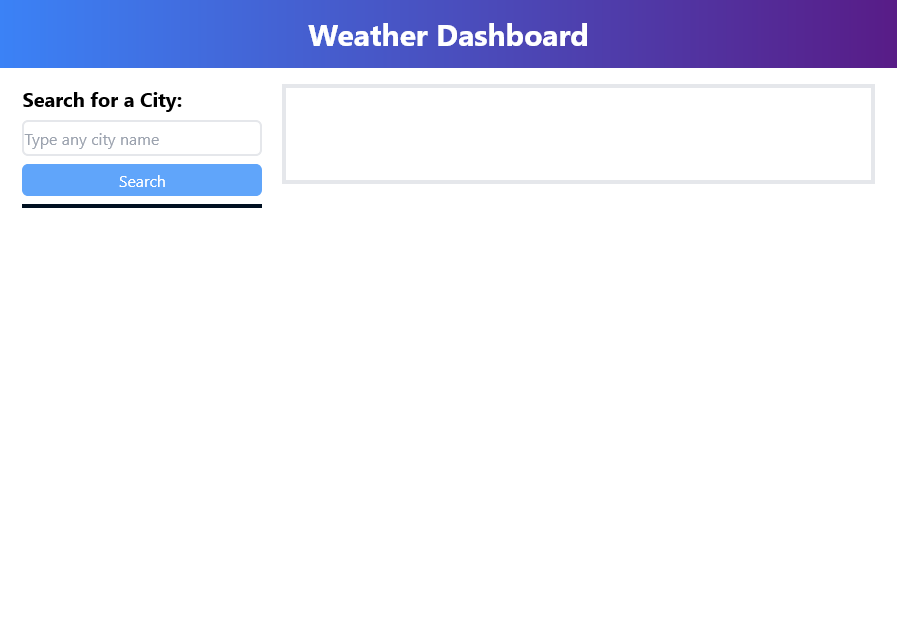
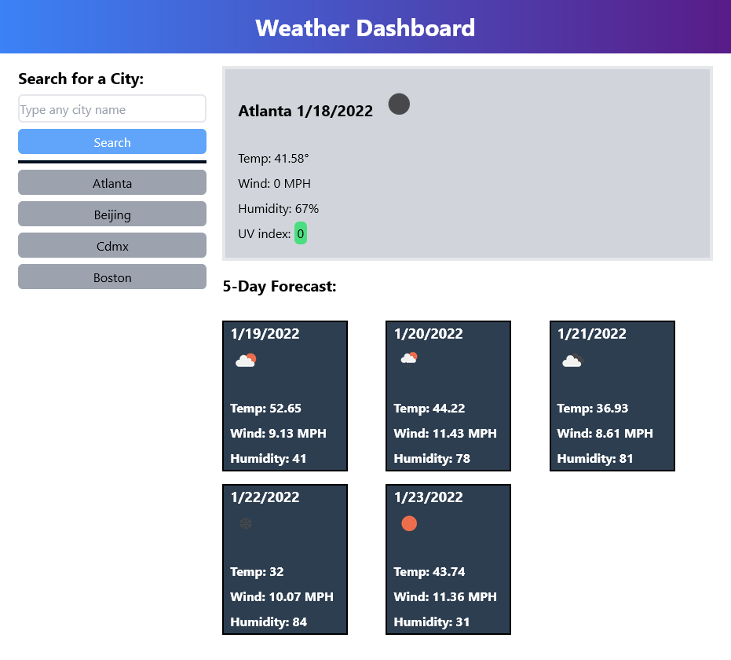

# Forecasting

* Deployed Webpage link: https://andrev96.github.io/Forecasting/

* Github Repository link: https://github.com/AndreV96/Forecasting/

## List of technologies used:

* HTML/CSS

* JavaScript

## Screenshots

The following images show the web application's appearance and functionality:

### Before search:

### After search:

## Description

The purpose of this repository is to allow a user to search for any city in the world and see the weather conditions displayed for the current day and the forecast of the next 5 days of the city searched. The user will be presented with an input field where he will be able to type any city name in the world and the hit the search button to see the information. Once the search button has been clicked the webpage does a few fetch data functions through differente APIs to receive the information regarding the temperature, wind speed, humidity percentage, UV index, and date of the input city. Once the information is retrieved with the APIs, the html is created to show the information detailed above. 

### Webpage code structure

The webpage code uses Jqueary, tailwind css library, the weather API and Momently API to generate the webpage functionality and visual layout. The purpose of this homework was to put in practice the use of different web APIs to create a functional search tool. This so I can consolidate what I learnt in this bootcamp module and in general everything seen so far. 

### License: MIT

Contact information:

* Email: ventaslederer@hotmail.com

* Github: https://github.com/AndreV96/

